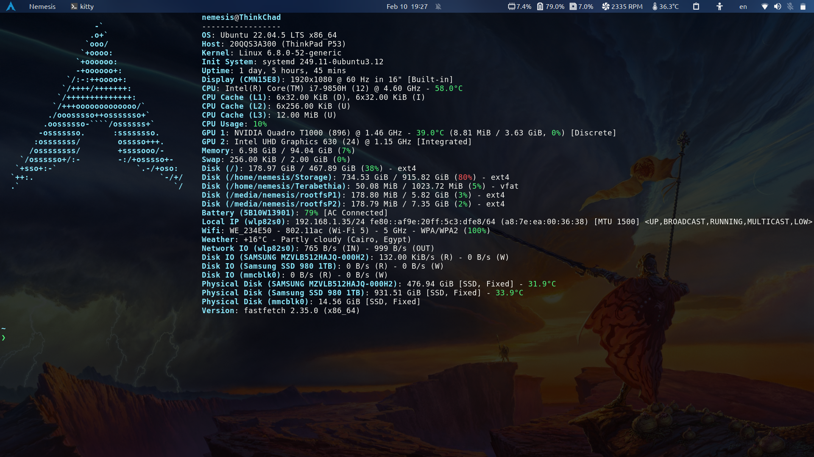
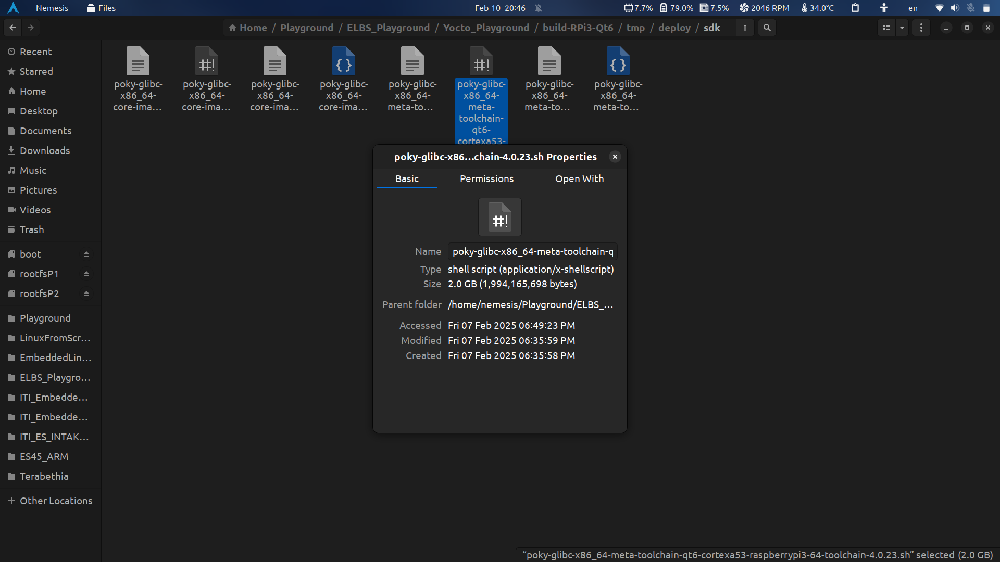

# Simple Infotainment System Using Qt6 & Yocto on Raspberry Pi 3B+

## Introduction
This is project, as the name suggests, is a GUI QtQuick application built using Qt6 framework for the Raspberry Pi 3B+. The application UI design is hugely inspired by Tesla's own UI and the app itself runs on a customized Yocto image (Kirkstone LTS) build for the Raspberry Pi that fully supports Qt6 and provides an SDK for cross-development. The project was a major success and this README file will be my way of documenting the entire process step-by-step.

## Motivation
So, why such huge time investment into a project this big while you get tasks/projects thrown at you daily in ITI? The answer to this lies in how my Qt mentor, [Eng. Anas Khamees](https://github.com/anaskhamees), motivated me to take such a route. The initial version of the project was to-be-run on a laptop and control its Capslock LED, but he encouraged us to go beyond that and do it for the Raspbery Pi. And, since I have some experience with The Yocto Project, I decided to make an image for it and he fully supported my decision. Huge shout out to him! :)

## Target Hardware Specifications
As stated earlier, the target hardware is a Raspberry Pi 3B+ 1GB RAM with the following pin configuration. Knowing the pin configuration will be important later on in order to communicate with the Pi via a serial terminal like `gtkterm` using a USB-to-TTL device as shown below.


## Build System Specifications
I have built this Yocto image on my trusty laptop **Thinkchad**: a Lenovo Thinkpad P53 with the specifications stated below. I made sure to record the time it took me to build both the image and SDK for reference. Bare in mind that performance may differ due to multiple reasons such as: temperature---a laptop is more likely to throttle than a PC; disk speed---I built it entirely on an SSD (it ate A LOT of storage) and it took almost 4 hours at constant 100% CPU load and over 40GB RAM usage; internet speed---this was a huge issue for me that was solved once I built in ITI's headquarters since their internet is the fastest there is; and lastly the performance of your machine---I am running a native/real Ubuntu 22.04 machine, not a VM.



## Yocto Image

### Setting Up Yocto Project Essentials

1. Start things off with by updating and upgrading packages.
   ```
   sudo apt update && upgrade -y
   ```

1. The Yocto Project documentation recommends installing the following packages.
   ```
   sudo apt install gawk wget git diffstat unzip texinfo gcc build-essential chrpath socat cpio python3 python3-pip python3-pexpect xz-utils debianutils iputils-ping python3-git python3-jinja2 libegl1-mesa libsdl1.2-dev python3-subunit mesa-common-dev zstd liblz4-tool file locales libacl1
   ```


### Cloning Meta-Layers and Choosing Kirkstone Release
The first thing to think about when creating a Yocto image is to know which functionalities would be needed to be implemented in the image. So, I gathered a list of meta-layers that I needed to add to the image and cloned them. 

1. The first step is to clone `poky` and checkout Kirkstone branch.
    ```bash
    git clone https://github.com/yoctoproject/poky.git
    cd poky
    git checkout kirkstone
    ```

1. Next, clone `meta-openembedded`.
    ```bash
    git clone https://github.com/openembedded/meta-openembedded.git
    cd meta-openembedded
    git checkout kirkstone
    ```

1. Then, since I am building an image for the Raspberry Pi 3B+, I need its BSP meta-layer.
    ```bash
    git clone https://github.com/agherzan/meta-raspberrypi.git
    cd meta-raspberrypi
    git checkout kirkstone
    ```

1. Finally, a meta-layer for Qt6 is needed. during this past week I had the pleasure of trying many Qt6 meta-layers but most of them failed. The one that actually worked with me and had a logical branch structure (to checkout Kirkstone) was [this one](https://github.com/shr-project/meta-qt6) provided by [shr-project](https://github.com/shr-project).
    ```bash
    git clone https://github.com/shr-project/meta-qt6.git
    cd meta-qt6
    git checkout jansa/kirkstone
    ```

### Creating A New Project and Adding Layers
1. Source the script located in the `poky` folder to start `bitbake` and create a new image folder. Here, I named my image `build-RPi3-Qt6`. Conventionally, all image names start with `build` to make them distinct. Sourcing this script will change your directory to a new folder named the same as the image name and start bitbake.
   ```bash
   source poky/oe-init-build-env build-RPi3-Qt6
   ```

1. Next, we will start adding layers one by one to the image using the command `bitbake-layers add-layer`. Note that `meta-raspberrypi` depends on other layers to function correctly, hence they will be added before it. Same story goes to `meta-qt6`. Ergo, add the layers in the same order as written here to avoid any unnecessary errors.
    ```bash
    bitbake-layers add-layer ../meta-openembedded/meta-oe
    bitbake-layers add-layer ../meta-openembedded/meta-python
    bitbake-layers add-layer ../meta-openembedded/meta-networking
    bitbake-layers add-layer ../meta-openembedded/meta-multimedia
    bitbake-layers add-layer ../meta-raspberrypi
    bitbake-layers add-layer ../meta-qt6/ 
    ```

1. Make sure all the layers were added successfully by using the command:
   ```
   bitbake-layers show-layers
   ```

### Additions to `local.conf`
1. Open the file `local.conf` to customize your image.
    ```bash
    vim conf/local.conf
    ```
1. Essential additions:

      1. Comment any line that specifies a certain `MACHINE` and add this one:
        ```
        ## Machine Name: MUST INCLUDE
        MACHINE = "raspberrypi3-64"
        ```
      
      1. UART must be enabled in order to be able to communicate with the Pi using serial terminal.
        ```
        ENABLE_UART = "1"
        ``` 
      
      1. Expanding the size of root filesystem can be beneficial. I have set mine to 5GB since I used a 32GB SD card and plan to add a lot of packages.
        ```
        ## Extend Root Filesystem Size to 5GB (size written in bytes)
        IMAGE_ROOTFS_EXTRA_SPACE = "5242880"
        ```
1. Quality-of-life additions:
    1. Add `nano` to have a good text editor and `htop` to monitor system vitals.
        ```
        IMAGE_INSTALL:append = " htop "
        IMAGE_INSTALL:append = " nano "
        ```
1. `ssh` and wifi-related additions:
    1. Enable ssh and install `openssh`.
        ```
        ENABLE_SSH_SERVER = "1"
        EXTRA_IMAGE_FEATURES ?= "debug-tweaks ssh-server-openssh "
        IMAGE_INSTALL:append = " openssh-sftp-server gdbserver "
        ```
    
    1. Install `connmanctl` to turn on wifi and connect to wifi networks.
        ```
        IMAGE_INSTALL:append = " connman-client "
        ```

    1. Install `rsync` to ease file transfer during app development.
        ```
        IMAGE_INSTALL:append = " rsync "
        ```

1. Wayland & Qt-related additions:
    1. Make sure the image supports `vc4graphics`, Wayland display server for super-smooth animations, and `qtwayland` to support running Qt applications on Wayland. 
        ```
        MACHINE_FEATURES:append = " vc4graphics "  

        DISTRO_FEATURES:append = " wayland opengl "
        IMAGE_INSTALL:append = " qtwayland "
        CORE_IMAGE_EXTRA_INSTALL += " wayland weston "
        ```
    1. Install `make` and `cmake`.
        ```
        IMAGE_INSTALL:append = " make cmake "
        ```

1. Bash, Systemd, and VNC:
    1. Append `bash` to the install packages.
        ```
        IMAGE_INSTALL:append = " bash "
        ```
    1. These bunch of lines are used to add Systemd support to the final image.
        ```
        VIRTUAL-RUNTIME:init_manager = " systemd "
        DISTRO_FEATURES:append = " systemd "
        DISTRO_FEATURES_BACKFILL_CONSIDERED:remove = " sysvinit "
        VIRTUAL-RUNTIME_init_manager = " systemd "
        VIRTUAL-RUNTIME_initscripts = ""
        IMAGE_INSTALL:append = " systemd systemd-analyze "
        IMAGE_INSTALL:append = " coreutils util-linux procps iproute2"
        VIRTUAL-RUNTIME_base-utils = "coreutils"
        VIRTUAL-RUNTIME_base-utils-hwclock = "util-linux-hwclock"
        VIRTUAL-RUNTIME_base-utils-syslog = "util-linux"
        ```
    1. These additions were to install a VNC server on the Pi but, unfortunately, it did not work. I will leave them here for reference.
        ```
        DISTRO_FEATURES:append = " pam "
        IMAGE_INSTALL:append = " tigervnc "
        IMAGE_INSTALL:append = " perl fltk "
        ```

1. The final addition is to avoid running out of space on the long run: 
    1. Set a directory for downloaded packages/repositories and build cache common for all images so that you won't need to redownload everything again for a slightly different image.
        ```
        DL_DIR = "/home/nemesis/Playground/ELBS_Playground/Yocto_Playground/DL_DIR"

        SSTATE_DIR = "/home/nemesis/Playground/ELBS_Playground/Yocto_Playground/SSTATE_DIR"
        ```

### Building The Image
Since I want to create a Wayland-based image, I will produce a `core-image-weston`. 
```bash
time bitbake core-image-weston 
```

It took me about 4 hours to finish building the image.


If you keep getting a `do_fetch` failure, a good trick is to do all the internet-hungry tasks first then building the image later when no good internet connection is nearby.
```bash
time bitbake core-image-weston --runonly=fetch
```

The output image can be found in `build-RPi3-Qt6/tmp/deploy/images/raspberrypi3-64/` under the name `core-image-weston-raspberrypi3-64.wic.bz`.

### Generating The SDK
One of the strongest features of Yocto is the ease of generating a Software Development Kit (SDK) for a specific architecture without doing all the hardwork of fetching, configuring, compiling, and so on.

Generating an SDK does take lots of time but it basically revolves around this command. Execute it and you are basically done.
```bash
time bitbake meta-toolchain-qt6
```
It took over 2 and a half hours.


You will find a wopping 2GB shell script that will do the sdk generation for you. It can be found under `build-RPi3-Qt6/tmp/deploy/sdk`


### Burning The Image
The file `core-image-weston-raspberrypi3-64.wic.bz` is a compressed form of the image. Extract it using:
```bash
bzip2 -d -f /home/nemesis/Playground/ELBS_Playground/Yocto_Playground/build-RPi3-Qt6/tmp/deploy/images/raspberrypi3-64/core-image-weston-raspberrypi3-64.wic.bz2
```

This will give you a file named `core-image-weston-raspberrypi3-64.wic` with a size of about 8GB.

Use a tool like `balena etcher` or `dd` to flash it onto your sd card.

### Using the SDK
Run the chonky script found in `build-RPi3-Qt6/tmp/deploy/sdk`. It will ask you for an install directory. I chose `build-RPi3-Qt6/SDK/`.
```
./poky-glibc-x86_64-meta-toolchain-qt6-cortexa53-raspberrypi3-64-toolchain-4.0.23.sh
```

Finally, your will find a file in `build-RPi3-Qt6/SDK/` named `environment-setup-cortexa53-poky-linux`. Source this file.
```
source ./environment-setup-cortexa53-poky-linux
```

From this terminal, when building a qt project, it will cross-build it for the Raspberry Pi 3B+. Use the normal cmake commands to generate a makefile and build the app.
```bash
cmake -S . -B build
cmake --build buildYocto --parallel 12
```


### Setting Up The Image
You can either do the following steps though a monitor and keyboard connected to the Raspberry Pi or through a serial terminal via your PC.

If you are using a serial serial terminal, follow the following instructions:
 1. My serial terminal of choice is `gtkterm`. In order to install it, simply:
    ```
    sudo apt install gtkterm -y
    ```
1. A common problem with USB-to-TTL devices is that they keep getting disconnected once it is connected to the PC. To solve this, write:
   ```
   sudo apt remove brltty
   ```
1. Another common issue is `gtk` saying permission denied for this user. To solve this, add your user to the dialout group:
   ```
   sudo usermod -a -G dialout YOUR_USERNAME
   ```
1. Insert the SD card into the Pi.
1. Connect the Pi to USB-to-TTL as follows:
   1. GND --> GND
   1. Tx  --> Rx
   1. Rx  --> Tx
1. Connect USB-to-TTL to the PC via USB.
1. Launch `gtkterm` using the following command:
   ```
   gtkterm -p /dev/ttyUSB0 -s 115200
   ```
1. Power on the Pi. You should see the starting screen on `gtkterm`.


#### Turn on Wifi
I used `connmanctl` to connect to my wifi network.
```
enable wifi
agent on
scan wifi
services
connect wifi_XXX_YYY_managed_psk
# enter your network passwork
exit
systemctl enable connman
systemctl start connman
```

#### ssh into Pi
From your PC/laptop:
```
ssh root@192.168.1.113
```

#### Using rsync to Transfer The App via Network
Simply, run this command while standing in the directory where the app is located:
```bash
rsync -av -e ssh appInfotainmentSystem-UI root@192.168.1.113:/home/root
```

#### Changing The Default Shell to Bash
1. Open `passwd` file.
    ```bash
    nano /etc/passwd
    ```
1. Change the shell for the root user from `/bin/sh` to `/bin/bash`.

1. Save and exit.

1. Check the used shell by running:
    ```bash
    echo $SHELL
    # it should output /bin/bash
    ```


## Qt Application
### Brief
I used `QtCreator` to create a QtQuick application. My main goal was to implement the functionality of GPIO/LED control but I decided to learn more about Qt and create a visually-appealing GUI even if most of the elements present in it are static.

### Features
1. A login screen that displays ITI's logo for 2 seconds before shifting into the app GUI.
1. A section that displays system time.
1. An interactive lock icon that changes when clicked on.
1. A map GUI component that **unfortunately** did not work on the Pi so I settled for a static image.
1. A search bar that accepts text.
1. Finally, the star of the show: a light icon that, when pressed, toggles an actual LED connected to GPIO pin 26 of the Raspberry Pi.

### Resources
I mostly relied on [MontyTheSoftwareEngineer's](https://www.youtube.com/@MontyTheSoftwareEngineer) videos titled [Let's Recreate the Tesla UI in Qt and QML PART 1!](https://www.youtube.com/watch?v=Tq-E6lqO6tM&t=1920s) and [Part 2: Let's Recreate the Tesla UI in Qt and QML](https://www.youtube.com/watch?v=MEdJNc1tfwE&t=2289s). Following him step-by-step gave me the knowledge and intuition needed to accomplish my goal.

## Results
See for yourself! :D


https://github.com/user-attachments/assets/d76b72f1-4bde-4381-a1d2-da9f32d8779d


